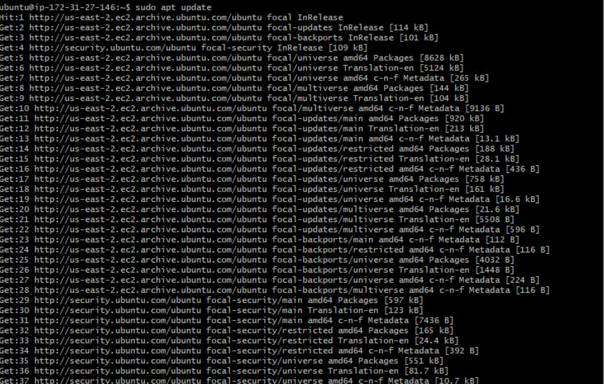
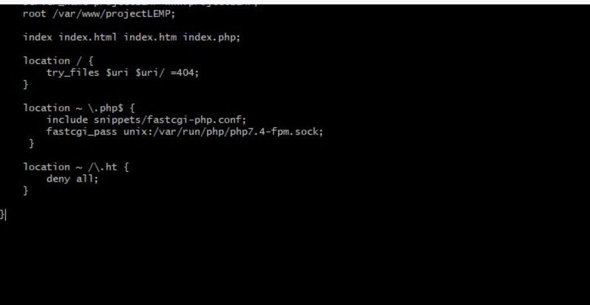
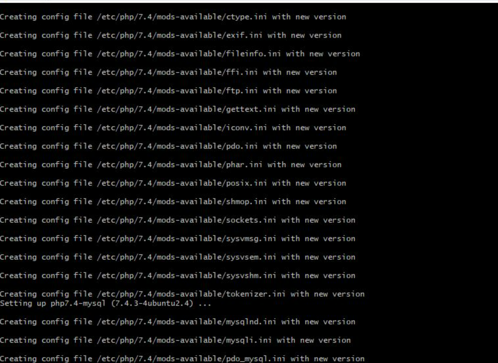
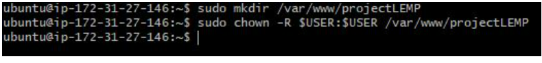
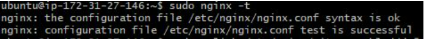
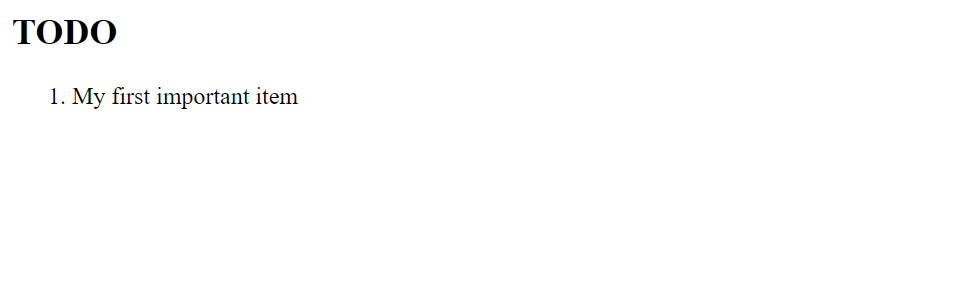
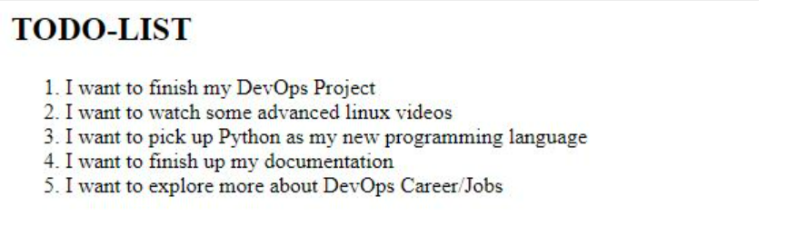

# project-2 : Installing LEMP stack
Step 1a: Updating, Upgrading and Installing nginx 
1. sudo apt update -y
2. sudo apt upgrade -y

Step 1b: Install nginx
1. sudo apt install nginx 
2. sudo systemctl status nginx

We have successfully installed PHP and its components.

Next, we will configure Nginx to use the php processor.

Step 4 - Configuring Nginx to Use PHP Processor

Created a directory for projectLEMP using:

sudo mkdir /var/www/projectLEMP

Assign ownership to the directory 

$ sudo chown -R $USER:$USER /var/www/projectLEMP

Step 5: Test PHP with Nginx
Created a test PHP file in the document root using nano text editor, this is to validate that Nginx can correctly hand .php files off to the PHP Processor

$ nano /var/www/projectLEMP/info.php

STEP 6 – RETRIEVING DATA FROM MYSQL DATABASE WITH PHP

